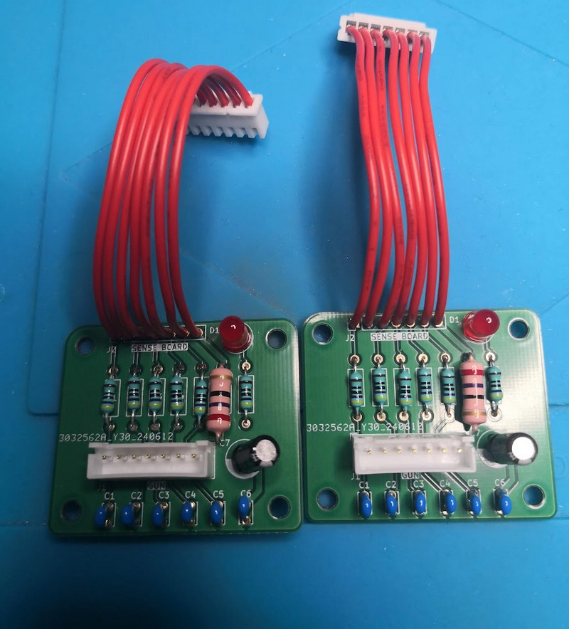

# SEGA Gun type II Input Protection Board for *The House of the Dead 2* 

This repository contains the **KiCAD project files** for the **Gun II Input Protection Board (GIPB)**, a component designed to help protect the gun sensors in *The House of the Dead 2* arcade machines. The design is based on SEGA's **Service Bulletin (09/10/2002)**, which introduced this board to prevent or minimize damage to the **Gun Sense Board** and **LED Boards** caused by connection issues.

## Table of contents

- [Why](#why)
- [Description](#-description)
- [Schematics](#-schematics)
- [Installation Guide](#-installation-guide)
- [Repository contents](#-repository-contents)

## Why?

This was done during some live events on Twitch.tv and tested for some time.

This is a must have for people using the arcade cabinet for guns on a hostile environment

## 📜 Description

Over time, disconnections or improper handling of the gun harnesses can lead to damage in the **Gun Sense Board** or **LED Boards**, potentially rendering the guns non-functional. SEGA introduced this **Gun Input Protection Board** to mitigate this issue. While it **does not repair faulty hardware**, it acts as a safeguard against further damage, extending the lifespan of the arcade cabinet's gun system.  

- **Protects the Gun Sense Board & LED Boards** from connection-related damage  
- **Compatible with original HOTD2 and JPLW arcade hardware**  
- **Straightforward installation** – integrates between the gun harness and the Gun Sense Board  
- **Includes KiCAD project files** for custom PCB manufacturing  

## 📝 Schematics

This is the schematics:

## 🛠️ Installation Guide  

### 1️⃣ Preparation  

1- Send to manufacture the GERBER board to [JLCPCB](https://jlcpcb.com/) or other PCB manufacturer.

2- Get the components required, you can see here the Bill Of Materials [BOM](bom/ibom.html)

3- Solder the components.

Before installing the board, ensure that:  
- The **Gun Sense Board** and **guns are fully functional**  
- The **arcade cabinet is powered off**  

### 2️⃣ Installation Steps  
1. Locate the **Gun Sense Board** inside the arcade machine.  
2. Disconnect the gun harnesses from the **GUN1P** and **GUN2P** ports.  
3. Take the **Gun Input Protection Board (GIPB)** and connect its labeled **GUN1P** and **GUN2P** connectors to the corresponding ports on the **Gun Sense Board**.  
4. Reconnect Player 1’s (Blue Gun) harness into **GUN1P** on the **Protection Board**.  
5. Reconnect Player 2’s (Red Gun) harness into **GUN2P** on the **Protection Board**.  
6. Secure the **Protection Board** using the provided spacers and screws.  
7. Power on the arcade cabinet and enter **Self-Test Mode**.  
8. Navigate to **Gun Settings** and recalibrate the guns.  

## 📝 Repository Contents  

- **`/kicad/`** – KiCAD design files for the **Gun Input Protection Board**  
- **`/bom/`** – Circuit parts and assembly for reference  
- **`/gerbers/`** – Gerber files for PCB fabrication  
- **`/DOC/`** – Original bulletin

## 📢 Disclaimer  

I'm not responsible
===================
And yes, read below, no liability is assumed for misuse.

DISCLAIMER (See Licensing)
==========================
See LICENSE fo more information. 

This project is intended for preservation and repair purposes. **Use at your own risk.** The original SEGA hardware must be in **good working condition** before installation. This repository is **not affiliated with SEGA**.
